# 🧩 Working with Kubernetes Nodes

## 📌 Project Overview

This project introduces the concept of **Kubernetes Nodes**, which are the worker machines responsible for running containerized workloads in a Kubernetes cluster.

Using **Minikube**, this project provides a beginner-friendly, hands-on approach to understanding how nodes operate, how workloads are scheduled on them, and how DevOps engineers inspect, manage, and troubleshoot node-level resources.

---

## 🎯 Project Objectives

By the end of this project, learners will have:

- Understood what Kubernetes nodes are and their role in a cluster
- Explored node components and metadata
- Learned how pods are scheduled onto nodes
- Practiced inspecting node health and resources
- Gained hands-on experience using `kubectl` to manage nodes
- Applied real-world DevOps troubleshooting techniques

---

## 🧠 Key Concepts Covered

- Kubernetes Nodes (Worker Nodes)
- Control Plane vs Worker Nodes
- Node status and conditions
- Pod scheduling
- Node resource inspection
- Labels and selectors
- Basic troubleshooting

---

## 🛠️ Technologies Used

- Kubernetes
- Minikube
- kubectl
- Docker
- Linux (Ubuntu / Xubuntu)

---

## 🧠 Understanding Kubernetes Nodes and Cluster Architecture

A Kubernetes **node** is a worker machine responsible for running Pods.  
Each node contains:
- kubelet (communicates with the control plane)
- container runtime (Docker / containerd)
- kube-proxy (networking)

In this project, Minikube is used to simulate a Kubernetes cluster locally.  
By default, Minikube operates as a **single-node cluster**, where both control plane and workloads run on the same node.

This setup is ideal for:
- Learning Kubernetes fundamentals
- Testing configurations locally
- Development and experimentation

However, it does not fully represent production cluster behavior.

## ⚠️ Minikube Single-Node Limitation and Scaling Considerations

Minikube’s default configuration uses a **single node**, which introduces several limitations:

### Limitations
- No true node-level fault tolerance
- No realistic node autoscaling behavior
- Pod rescheduling occurs on the same physical node
- Limited simulation of production traffic distribution

### Scaling in Minikube
While Minikube supports multi-node clusters using:

```minikube start --nodes=2
```

This is still a **simulation** and does not provide:
- Cloud-based autoscaling
- Real infrastructure-level failures
- Managed load balancing

### Production Perspective
In production environments (EKS, GKE, AKS):
- Nodes are distributed across availability zones
- Node groups scale automatically based on demand
- Failed nodes are replaced, not restarted

This project acknowledges Minikube’s limitations while using it appropriately as a learning and testing platform.

## 🔄 Minikube Upgrade Options and Their Implications

Keeping Kubernetes tooling up to date is critical for:
- Security patches
- API compatibility
- Performance improvements

### Minikube Upgrade Options
Minikube can be upgraded using system package managers or direct binary updates.

Example:
```bash
minikube version
```

Upgrading Minikube may include:

Kubernetes version upgrades

Improved drivers and networking

Bug fixes and performance optimizations

Version Alignment

In production environments, version alignment is critical:

Kubernetes control plane

Node kubelet versions

Container runtime versions

Mismatched versions can lead to:

Scheduling issues

Feature incompatibilities

Performance degradation

This project highlights why controlled upgrades are essential in real-world Kubernetes operations.

## 📌 Key Learnings and Practical Takeaways

- Kubernetes nodes are the foundation on which Pods run
- Minikube is suitable for learning, not production simulation
- Single-node clusters limit fault tolerance and scaling realism
- Multi-node Minikube setups help conceptually but not operationally
- Production clusters rely on managed node groups and autoscaling
- Version upgrades must be planned and aligned across cluster components

These insights bridge the gap between local experimentation and real-world Kubernetes operations.

## 📁 Project Structure

```text
kubernetes-nodes-project/
├── README.md
└── img
```

## Areas for Improvement & Troubleshooting

This section demonstrates controlled troubleshooting scenarios commonly
encountered in Kubernetes environments. Issues were intentionally simulated
in a safe manner to validate diagnosis and recovery procedures.

---

### Metrics API Not Available

#### Issue
An attempt to retrieve node resource metrics using the command below initially
failed:

```bash
kubectl top nodes
The cluster returned the following error:

arduino
Copy code
Metrics API not available
This indicated that the Kubernetes Metrics API was not yet exposed to the
cluster, preventing access to CPU and memory usage statistics.


Resolution
The issue was resolved by enabling the Metrics Server addon in Minikube:

bash
Copy code
minikube addons enable metrics-server
After allowing sufficient time for the addon to initialize, node metrics
became available.

Verification
The command was re-run successfully:

bash
Copy code
kubectl top nodes
This confirmed that the Metrics API was operational and resource metrics
were accessible.
```


### Key Takeaway
This troubleshooting exercise demonstrates an understanding of Kubernetes
observability components, specifically the role of the Metrics Server in
providing cluster resource insights. It also highlights a structured
approach to identifying issues, applying corrective actions, and validating
successful recovery.


## 🏁 Conclusion

This project provides a solid foundation for understanding Kubernetes nodes and how workloads are scheduled and managed.
It reflects real-world DevOps practices and prepares learners for more advanced Kubernetes administration and cloud-native deployments.

## Below are screenshots of workflow:
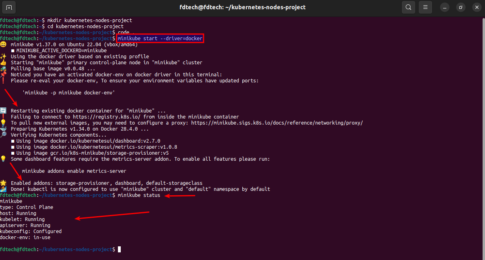
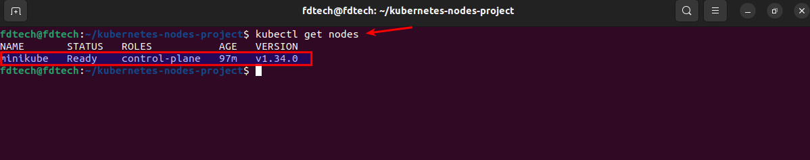
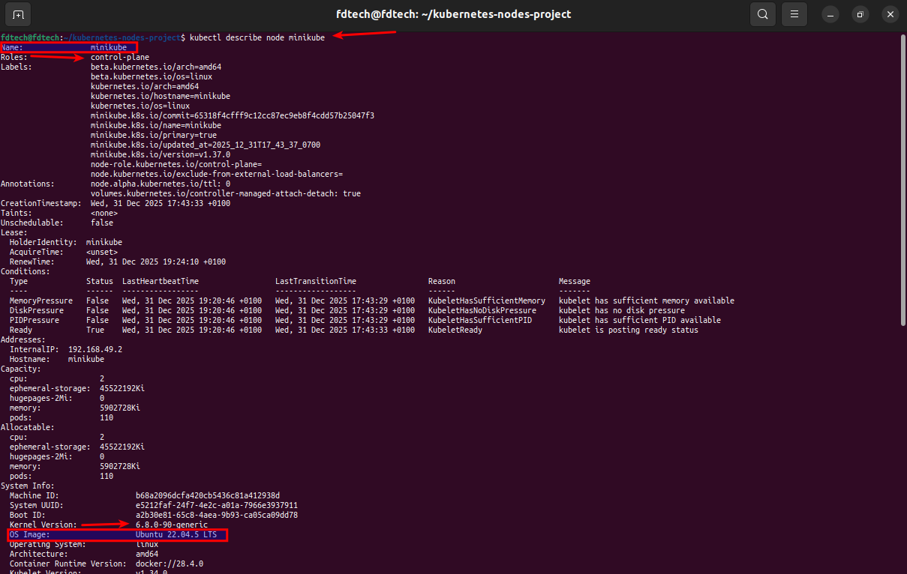
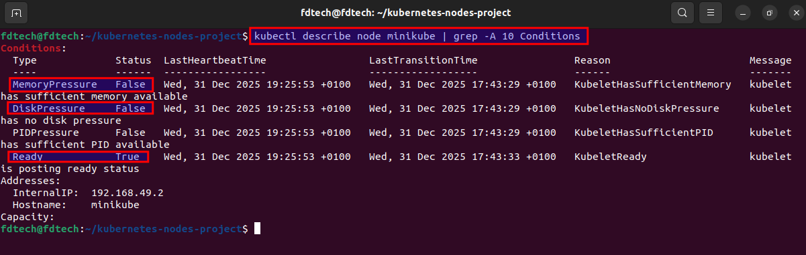
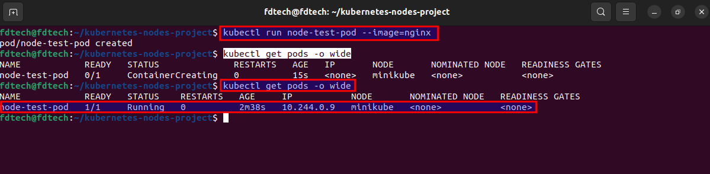
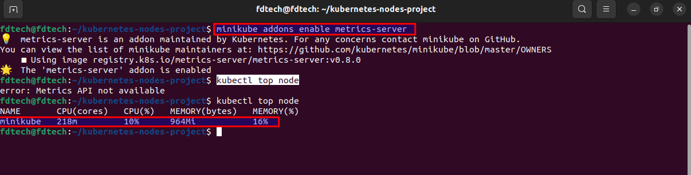
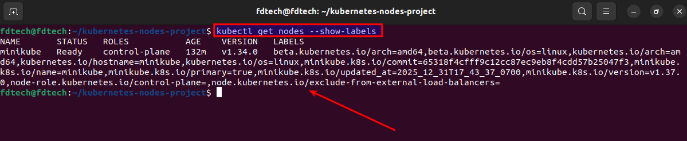
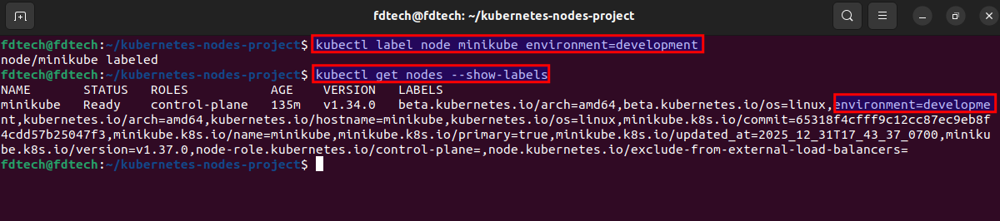
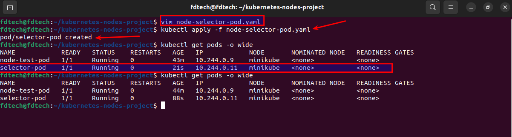
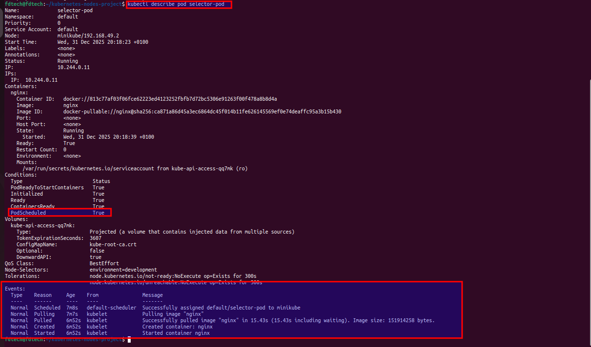
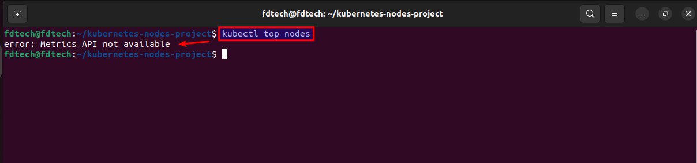
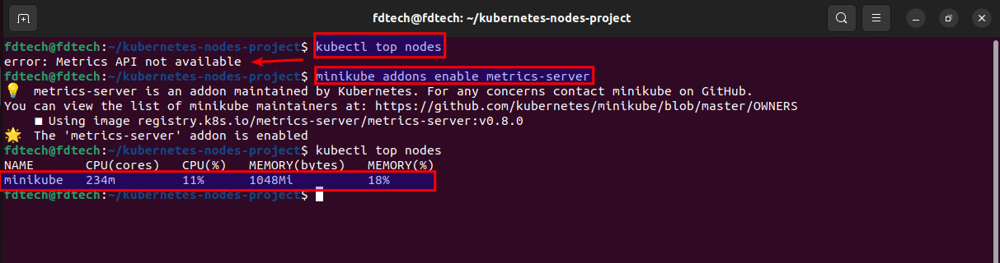

